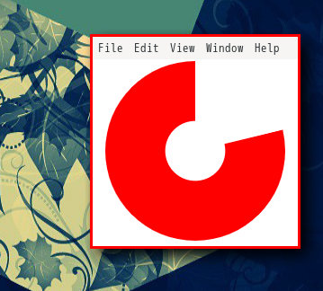

# Visual Timer

A countdown timer for focusing, which does not display extra information.  
(集中することを目的として、残り時間が映像としてのみ分かるタイマー)

* Set in 1 minute increments (1 分単位で設定可能)



## Develop Environment(開発環境)

* Node.js + electron + jQuery
* Bootstrap

At first time, you need install development library by yarn command.  
(プロジェクトを始めるには yarn コマンドで環境を用意してください。)

```bash
> yarn install

> run.sh
```

## Usage(使い方)

* Left click (左クリック)
  * restart timer. (タイマーの再スタート)
* Right click (右クリック)
  * stop timer & display settings. (タイマーの停止と設定の表示)